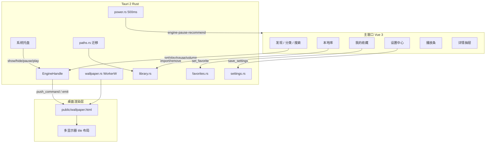

# 灵镜 LINGJING — 功能整理与优化路线图

> **版本**：v1.1.0 基线  
> **日期**：2026-08-19  
> **分支**：`v1.1.0`  
> **状态**：规划文档（待实施）  
> **关联 Spec**：`docs/comet/specs/` 下 Phase 1–3 各 capability

---

## 1. 文档目的

在 Phase 2（壁纸核心）与 Phase 3（系统整合）基本落地后，对当前功能做**完整盘点**，并列出**已知缺口、风险与优化项**，供后续迭代排期与验收使用。

本文档**不修改**既有 Spec 的已通过条款，仅补充「待优化 / 待补齐」清单与建议实现路径。

---

## 2. 当前功能总览

### 2.1 架构分层



### 2.2 已实现能力矩阵

| 模块 | 能力 | 状态 | 主要代码 |
|------|------|------|----------|
| **壁纸引擎 F4** | WorkerW/Progman 附着 | ✅ | `src-tauri/src/wallpaper.rs` |
| | 多显示器独立 tile | ✅ | `wallpaper.rs` + `public/wallpaper.html` |
| | set / play / pause / volume | ✅ | `src-tauri/src/lib.rs` |
| | 进度上报 + 循环播放 | ✅ | `wallpaper.html` + `App.vue` |
| | 启动恢复上次壁纸 | ✅ | `lib.rs` → `restore_last_wallpaper` |
| **本地库 F3** | 文件选择器 + 拖放导入 | ✅ | `App.vue` + `library.rs` |
| | 复制 / 引用两种策略 | ✅ | `settings.import_copy_to_data` |
| | 本地库删除（含物理文件） | ✅ | `library.rs::remove_item` |
| | 文件夹批量导入 | ❌ | Spec 有，未实现 |
| **收藏 F7** | favorites.json 持久化 | ✅ | `favorites.rs` |
| | 重启后收藏仍在 | ✅ | `App.vue::refreshLibrary` |
| **播放条 F6** | play/pause/prev/next/volume/loop | ✅ | `PlaybackBar.vue` + `App.vue` |
| | 循环模式持久化 | ❌ | 重启丢失 |
| **发现页 F1** | 占位 catalog + 分类/搜索/排序 | ✅ | `catalog.ts` + `WallpaperGrid.vue` |
| | 在线壁纸 API | ❌ | 离线 demo |
| **详情抽屉** | 预览 + 60s 倒计时 + 设壁纸 | ✅ | `DetailDrawer.vue` |
| | 分享 / 下载 | ❌ | toast「开发中」 |
| **设置 F8** | 开机启动（注册表） | ✅ | `settings.rs` + autostart plugin |
| | 全屏 / 电池 / RDP 自动暂停开关 | ✅ | `SettingsView.vue` + `power.rs` |
| | 默认音量滑块 | ✅ | `SettingsView.vue` |
| | 壁纸路径迁移 | ✅ | `paths.rs` + `MigrationModal.vue` |
| | 双击隐藏桌面图标 | ❌ | 仅持久化 toggle |
| **系统托盘** | 显示/暂停/播放/退出 | ✅ | `lib.rs` |
| | 关闭 → 隐藏主窗口 | ✅ | `on_window_event` |
| | 前端 `useTray` composable | ❌ | Rust 端全包，无前端监听 |
| **性能 F9** | 全屏 / 电池 / RDP 自动暂停 | ✅ | `power.rs` |
| | prefers-reduced-motion | ❌ | Spec 预留 |
| | 低端机降级 | ❌ | Spec 预留 |

---

## 3. 已知问题与优化项

按**优先级**与**影响面**分组。每项含：问题描述、影响、建议改法、涉及文件、验收标准。

---

### P0 — 数据一致性 / 明显 Bug ✅ 已完成（2026-08-19）

#### OPT-P0-01 删除本地项未清理收藏 ✅

| 字段 | 内容 |
|------|------|
| **问题** | `remove_item` 只更新 `library.json` 并删除物理文件，不调用 `favorites::set_favorite(id, false)` |
| **影响** | 「我的收藏」出现已删除项的幽灵卡片；`favorites.json` 与 `library.json` 不一致 |
| **建议** | 在 `library::remove_item` 末尾调用 `favorites::set_favorite(app, id, false)`；前端 `refreshLibrary` 后收藏列表自动更新 |
| **文件** | `src-tauri/src/library.rs`、`src-tauri/src/favorites.rs` |
| **验收** | 删除已收藏本地项 → 收藏页即时消失；重启后 `favorites.json` 不含该 id |

#### OPT-P0-02 设壁纸时未应用 defaultVolume ✅

| 字段 | 内容 |
|------|------|
| **问题** | `set_wallpaper` 不读取 `settings.default_volume`；仅 `restore_last_wallpaper` 会应用 |
| **影响** | 用户在设置中调整默认音量后，新设壁纸仍用引擎初始值 0.8 |
| **建议** | `set_wallpaper` 内 `load_settings` → 写入 `state.volume` → `push_command("volume", ...)` |
| **文件** | `src-tauri/src/lib.rs` |
| **验收** | 设置音量 30% → 设新壁纸 → 桌面有音轨媒体以 30% 播放 |

#### OPT-P0-03 开机启动 `--minimized` 未处理 ✅

| 字段 | 内容 |
|------|------|
| **问题** | autostart 注册参数 `--minimized`（`lib.rs:400`），但 `setup` 未解析 CLI |
| **影响** | 开机自启仍弹出主窗口，与「后台壁纸 + 托盘」预期不符 |
| **建议** | 在 `setup` 中检测 `std::env::args()` 含 `--minimized` → 主窗口 `hide()`；托盘仍可唤回 |
| **文件** | `src-tauri/src/lib.rs` |
| **验收** | 启用开机启动 → 重启系统 → 主窗口不显示，托盘可见，壁纸正常恢复 |

#### OPT-P0-04 删除当前播放壁纸无联动 ✅

| 字段 | 内容 |
|------|------|
| **问题** | 删除正在播放的本地项后，引擎状态与桌面可能不同步 |
| **影响** | 桌面可能继续播已删文件（404/黑屏），或引擎 `mediaId` 指向无效项 |
| **建议** | `remove_item` 前比对 `EngineHandle.state.media_id`；若匹配则 `engine_pause` + 可选 `clear_last_wallpaper`；前端 toast 提示 |
| **文件** | `library.rs`、`lib.rs`、`App.vue` |
| **验收** | 删除当前壁纸 → 桌面停止或回退静态；播放条状态一致 |

---

### P1 — 体验与性能

#### OPT-P1-01 PowerWatcher 每 500ms 读磁盘

| 字段 | 内容 |
|------|------|
| **问题** | `power.rs` 循环内每次 `settings::load_settings` 读 `settings.json` |
| **影响** | 不必要的磁盘 I/O；设置频繁保存时可能读到半写文件 |
| **建议** | 方案 A：`Arc<RwLock<AppSettings>>` 挂 `State`，`save_settings` 时更新；方案 B：watcher 仅订阅 `settings-changed` 事件 |
| **文件** | `power.rs`、`settings.rs`、`lib.rs` |
| **验收** | 运行 10 分钟无 settings 变更时，磁盘读取次数 ≈ 0（或仅启动时 1 次） |

#### OPT-P1-02 自动恢复忽略用户手动暂停

| 字段 | 内容 |
|------|------|
| **问题** | 离开全屏/插电/退出 RDP 一律 emit `action: "play"` |
| **影响** | 用户手动暂停后，环境变化会意外恢复播放 |
| **建议** | 引擎状态增加 `user_paused: bool`；手动 pause 置 true，手动 play 置 false；自动恢复前检查 |
| **文件** | `wallpaper.rs`（EngineState）、`lib.rs`、`App.vue` |
| **验收** | 手动暂停 → 退出全屏 → 仍保持暂停 |

#### OPT-P1-03 路径迁移元数据策略不清

| 字段 | 内容 |
|------|------|
| **问题** | 迁移复制 `settings.json`/`favorites.json` 到新目录，但应用始终从 `app_data_dir` 读取；`library.json` 迁到新路径后旧目录可能残留 |
| **影响** | 用户误以为「全部数据已迁走」；旧目录占磁盘；双份 JSON 易混淆 |
| **建议** | ① 迁移 UI 明确列出「会迁移 / 不会迁移」；② 迁移成功后可选「清理旧 library 媒体」；③ 或统一 `data_root` 概念 |
| **文件** | `paths.rs`、`MigrationModal.vue`、`SettingsView.vue` |
| **验收** | 迁移完成后 UI 说明清晰；无冗余双份 `library.json` 被误读 |

#### OPT-P1-04 引用导入模式无失效提示

| 字段 | 内容 |
|------|------|
| **问题** | `importCopyToData=false` 仅存原路径，源文件移动/删除后设壁纸失败 |
| **影响** | 用户不知壁纸已失效，直到设壁纸时才 toast 报错 |
| **建议** | 本地库列表启动时校验 `path.exists()`；失效项标记「源文件缺失」；设壁纸前拦截 |
| **文件** | `library.rs`、`LocalLibraryView.vue` |
| **验收** | 移动源文件后本地库显示缺失态；设壁纸给出明确指引 |

#### OPT-P1-05 全屏检测偏粗

| 字段 | 内容 |
|------|------|
| **问题** | 前台窗口矩形 ⊆ 显示器矩形即判全屏；最大化窗口也会触发 |
| **影响** | 日常使用（浏览器最大化等）可能误触发自动暂停 |
| **建议** | 增加 `WS_MAXIMIZE` / 无边框全屏检测；或设置项「最大化时也暂停」默认关 |
| **文件** | `power.rs`、`settings.rs`、`SettingsView.vue` |
| **验收** | 浏览器最大化不暂停；真全屏游戏/视频暂停 |

#### OPT-P1-06 Autostart 双写

| 字段 | 内容 |
|------|------|
| **问题** | Rust `setup` 读 settings 写注册表；前端 `SettingsView` watch autostart 也调用 `applyAutostart` |
| **影响** | 逻辑重复，边界情况下可能竞态 |
| **建议** | 统一由 Rust `save_settings` 处理 autostart；前端仅 invoke save |
| **文件** | `lib.rs`、`useSettings.ts`、`SettingsView.vue` |
| **验收** | 切换开机启动开关仅一处写注册表；行为不变 |

---

### P2 — 功能补齐（Spec 已规划）

| ID | 项 | 说明 | 关联 Spec |
|----|-----|------|-----------|
| OPT-P2-01 | 双击隐藏桌面图标 | Win32 Shell：`SHELLSTATE.fShowAllObjects` 或桌面钩子 | `settings-page/spec.md` |
| OPT-P2-02 | prefers-reduced-motion | CSS `@media (prefers-reduced-motion)` + 壁纸降帧/静态 | `performance-power/spec.md` |
| OPT-P2-03 | 低端机降级 | 检测内存/CPU tier → 禁 GIF / 降帧 / 静态回退 | `performance-power/spec.md` |
| OPT-P2-04 | 分享 / 下载 | DetailDrawer 按钮接真实逻辑（导出文件 / 复制链接） | `detail-drawer/spec.md` |
| OPT-P2-05 | 文件夹批量导入 | ~~`open({ directory: true })` + 递归扫描~~ **不做** | `local-library/spec.md` |
| OPT-P2-06 | 在线壁纸服务 | 需后端 API；当前 `catalog.ts` 为离线占位 | `discover-browse/spec.md` |
| OPT-P2-07 | 循环模式持久化 | `settings.json` 增加 `loopMode` 字段 | `playback-control/spec.md` |
| OPT-P2-08 | README 更新 | 记录 Phase 2/3 功能、数据目录结构、开发/构建说明 | — |

---

### P3 — 代码卫生与文档

| ID | 项 | 说明 |
|----|-----|------|
| OPT-P3-01 | PlaybackBar loopMode 重复 | `PlaybackBar.vue` 内部 ref 与 `App.vue` 重复，应单一数据源 |
| OPT-P3-02 | Phase 3 Comet 归档 | 补 `docs/comet/changes/phase3-system/` brief + verification + archive |
| OPT-P3-03 | Rust 编译 warning | `lib.rs` unused import 等清理 |
| OPT-P3-04 | 缺失媒体文件恢复 | `restore_last_wallpaper` 若 uri 不存在 → 跳过并写日志 |

---

## 4. 数据目录说明（当前行为）

便于迁移优化（OPT-P1-03）与用户文档（OPT-P2-08）对齐。

```
%APPDATA%/com.lingjing.app/          ← app_data_dir（固定）
├── settings.json                    ← 始终在此读写
├── favorites.json                   ← 始终在此读写
├── last_wallpaper.json              ← 始终在此读写
└── library/                         ← 默认媒体根（无 override 时）
    ├── library.json
    └── <uuid>.mp4 / ...

<libraryDirOverride>/                ← 用户自定义路径（可选）
├── library.json                     ← override 后索引在此
├── settings.json                    ← 迁移时会复制，但应用不读
├── favorites.json                   ← 迁移时会复制，但应用不读
└── library/ 或 根目录媒体文件       ← 取决于迁移 plan
```

**注意**：`library_dir_override` 指向的目录即为 `library_root`；`library.json` 位于该目录根下，而非 `app_data_dir`。

---

## 5. 建议实施顺序

### 阶段 A — 快速修复（1–2 天）✅ 已完成

1. OPT-P0-01 删除清收藏  
2. OPT-P0-02 设壁纸应用音量  
3. OPT-P0-03 `--minimized` 静默启动  
4. OPT-P0-04 删当前壁纸联动  

**出口标准**：P0 四项手动验收通过；`pnpm build` + `cargo build` 无新增错误。

### 阶段 B — 稳定性（2–3 天）✅ 已完成

5. OPT-P1-01 PowerWatcher 内存缓存  
6. OPT-P1-02 尊重手动暂停  
7. OPT-P1-06 Autostart 单点写入  
8. OPT-P1-03 迁移 UI 说明 + 旧目录清理选项  

### 阶段 C — 体验 polish（按需）✅ 已完成

9. OPT-P1-04 引用导入失效检测  
10. OPT-P1-05 全屏检测精细化  
11. OPT-P2-07 循环模式持久化  
12. OPT-P2-08 README  

### 阶段 D — 大功能 ✅ 部分完成（2026-08-19）

| ID | 项 | 状态 |
|----|-----|------|
| OPT-P2-01 | 双击隐藏桌面图标 | ✅ WH_MOUSE_LL + SysListView32 ShowWindow |
| OPT-P2-02 | prefers-reduced-motion | ✅ UI CSS + 壁纸静态首帧 |
| OPT-P2-03 | 低端机降级 | ✅ <6GB RAM 自动 lowPower（降 playbackRate + 静态偏好） |
| OPT-P2-04 | 分享 / 下载 | ✅ 复制剪贴板 + 导出对话框 |
| OPT-P2-05 | 文件夹批量导入 | ❌ **不做**（产品决定） |
| OPT-P2-06 | 在线壁纸 API | ⏸ 不在当前范围（需后端） |
| OPT-P3-04 | 缺失媒体恢复跳过 | ✅ |

---

## 6. 验收检查表（阶段 A 模板）

| ID | 步骤 | 预期 |
|----|------|------|
| T-A1 | 收藏本地项 → 本地库删除 | 收藏页无该项 |
| T-A2 | 设置音量 20% → 设新壁纸 | 音量约 20% |
| T-A3 | 开机启动 + 重启 | 无主窗口，托盘在，壁纸恢复 |
| T-A4 | 播放中删除该本地项 | 桌面停止/无黑屏错误 |
| T-A5 | `pnpm build` | 通过 |
| T-A6 | `cargo build --manifest-path src-tauri/Cargo.toml` | 通过 |

---

## 7. 不在本路线图范围

- macOS / Linux 移植  
- libmpv / WMF 原生解码  
- Web/HTML5 壁纸页、Shader/GLSL  
- 多屏 Span/Per-display 分配（当前为 stretch tile，已可用）  
- 登录 / 云同步  

---

## 8. 变更记录

| 日期 | 作者 | 说明 |
|------|------|------|
| 2026-08-19 | Agent | 初版：Phase 2/3 功能盘点 + P0–P3 优化项 |
| 2026-08-19 | Agent | 实施阶段 A：P0 四项全部落地 |
| 2026-08-19 | Agent | 实施阶段 B：P1-01/02/03/06 全部落地 |
| 2026-08-19 | Agent | 实施阶段 C：P1-04/05、P2-07/08 全部落地 |
| 2026-08-19 | Agent | 实施阶段 D：P2-01~04、P3-04；P2-05 明确不做 |

---

## 9. 相关文档

- Phase 2 归档：`docs/comet/archive/2026-08-19-phase2-wallpaper-core/`
- Phase 3 Spec：`docs/comet/specs/settings-system-integration/`、`power-watch/`、`library-paths/`、`system-tray/`、`local-library-delete/`
- 性能预留：`docs/comet/specs/performance-power/spec.md`
